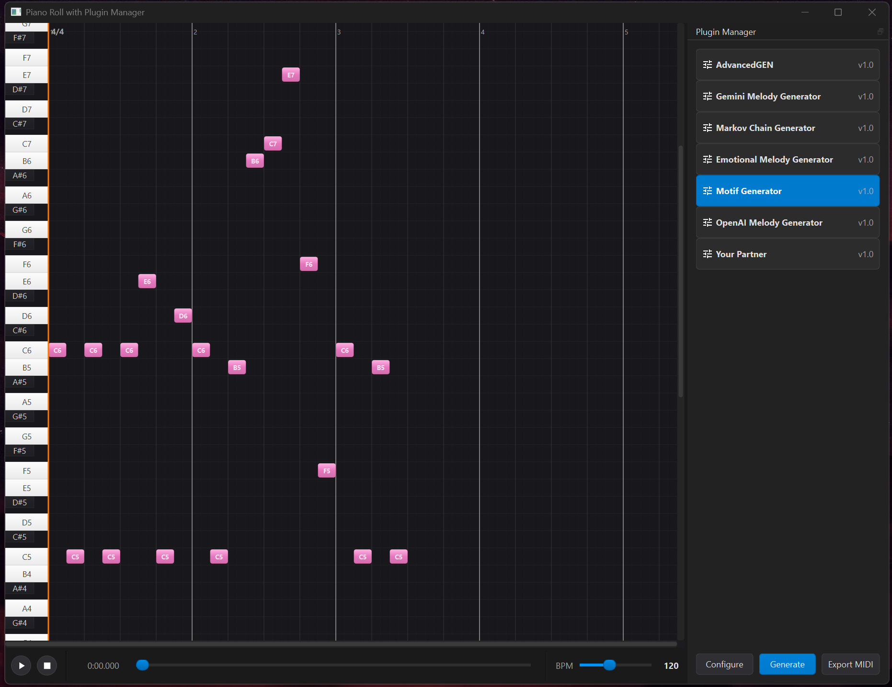

# 🎹 MIDI Generator Piano Roll


> 🎼 A plugin-powered standalone piano roll app written in Python that lets you generate MIDI using motif and Markov algorithms, visualize them, play them, and export to `.mid`.

---

## ✨ Key Features

- 🎹 **Modern Piano Roll** with grid lines, time ruler, and MIDI notes
- 🧩 **Plugin Manager** to run motif, Markov, and custom generation logic
- 🔌 **Drop-in Python Plugins** – Easily extend the app with your own .py files
- 🛠️ **Dynamic Parameter Dialogs** – Each plugin has its own customizable settings
- 📤 **Export to MIDI** with velocity/pitch embedded (even if not shown in UI)
- ⏯ **Playback Controls** with beat-synced transport
- 🪟 **Dockable Plugin Panel** – Plugin Manager can be dragged and reattached freely

---

## 🖼️ Screenshots

### 🎼 Generated MIDI using Motif Generator  


### 🧠 Markov Chain Plugin Output + Plugin Panel Floating  


---

## 🧩 Plugin System

The plugin system is modular and developer-friendly:

```python
class MyCustomGenerator(PluginBase):
    def generate(self, **params):
        return [
            pretty_midi.Note(
                pitch=64,
                velocity=100,
                start=0.0,
                end=0.5
            )
        ]

```

Define generate() and return a list of PrettyMIDI notes

Add optional get_parameter_info() to customize UI controls per plugin

📖 Full developer reference: docs/plugin-docs.md

🛠️ Project Structure

piano_roll_project/
├── main.py              # Entry point
├── piano_roll.py        # GUI and plugin panel
├── note_display.py      # Piano roll renderer
├── plugin_api.py        # Plugin contract
├── plugin_manager.py    # Dynamic plugin loader
├── export_utils.py      # MIDI writer
├── midi_player.py       # Internal MIDI sequencer
├── plugins/
│   ├── markov_generator.py
│   ├── motif_generator.py
│   └── melody_generator.py
└── docs/
    ├── project-details.md
    └── plugin-docs.md

🚀 Getting Started
1. Clone and install
git clone https://github.com/WebChatAppAi/midi-gen.git
cd midi-gen
pip install PySide6 pretty_midi numpy

2. Run it
python main.py

🎛 How To Use
Open the app

Pick a plugin from the Plugin Manager

Click Configure to tweak its settings

Click Generate to add notes

Press Play or Export MIDI when ready

💎 Extra Capabilities
🧩 Easily add your own plugins via plugins/*.py

🖱 Dock or float the Plugin Manager anywhere

🎼 Generated notes contain pitch and velocity info embedded in exported .mid

🔄 Real-time preview + loopable playback coming soon

🌟 What’s Next?
Plugin Marketplace (auto-discovery from GitHub)

AI Plugin Support (HuggingFace, LLaMA, MusicGen)

Auto-chord, Arp, and Drum Pattern plugins

Import .mid for editing🧠

Want to Contribute?
Read the full guide: docs/project-details.md

Fork → Build your plugin → Open a Pull Request

📄 License
MIT © WebChatAppAi

✨ Built with a love for generative music, modular design, and open creativity.
